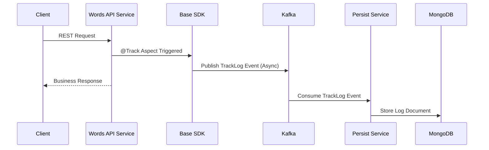

# Reverse Words API – Microservices with Reusable Base SDK

[](https://spring.io/projects/spring-boot)
[](https://openjdk.org/)
[](https://kafka.apache.org/)
[](https://www.mongodb.com/)

> A production-ready microservices architecture demonstrating enterprise patterns with a reusable Base SDK for cross-cutting concerns like tracking, validation, and configuration management.

---

## 📋 Table of Contents

- [Overview](#-overview)
- [Key Features](#-key-features)
- [Architecture](#-architecture)
- [Base SDK Design](#-base-sdk-design)
- [Services](#-services)
- [Data Flow](#-data-flow)
- [API Documentation](#-api-documentation)
- [Technology Stack](#-technology-stack)
- [Getting Started](#-getting-started)
- [Configuration](#-configuration)
- [Assumptions & Design Decisions](#-assumptions--design-decisions)
- [Future Enhancements](#-future-enhancements)
- [Author](#-author)

---

## 🎯 Overview

This project demonstrates a **microservices-based Spring Boot architecture** built around a **reusable Base SDK** that provides enterprise-grade cross-cutting capabilities:

- 📊 **Request/Response Tracking** via custom `@Track` annotation
- ✅ **Centralized Schema Validation** using JSON Schema
- 📨 **Event-Driven Architecture** with Kafka-based publishing
- 💾 **Asynchronous Persistence** to MongoDB
- ⚙️ **Configuration Reusability** across services
- 🔐 **Encryption Utility** for sensitive properties
- 🏗️ **Standardized Response Structures**

The system processes text operations (reverse words, search words) while transparently logging all activity through an event-driven pipeline.

---

## ✨ Key Features

### 🚀 Reusable Base SDK
One dependency that provides:
- **Track Annotation** – Automatic request/response tracking with zero code pollution
- **Schema Validation** – JSON schema validation using NetworkNT
- **Kafka Integration** – Centralized producer configuration and flag based consumer config
- **Mongo Integration** – Reusable persistence models
- **Encryption/Decryption Utility** – Support for encrypted passwords in configs
- **Base Controllers** – Standardized API behavior with consistent error handling

### ⚡ Performance & Scalability
- **Asynchronous DB Operations** – API latency unaffected by logging operations
- **Event-Driven Architecture** – Decoupled services communicate via Kafka
- **Non-Blocking Tracking** – High throughput under heavy load

### 🔍 Observability
- **Aspect-Based Tracking** – Automatic capture of request/response/execution time and other metadata
- **Structured Logging** – All logs published to Kafka for centralized processing
- **MongoDB Indexing** – Fast full-text search on tracked requests

### 🛡️ Security Ready
- **Encryption/Decryption Utility** – Production-ready config encryption support
- **SSL/TLS Demo** – Sample certificates for mutual TLS configuration

---

## 🏗️ Architecture

### High-Level System Design

```mermaid
flowchart LR
    Client --> API[Reverse/Search API Service]
    API -->|TrackLog Event| Kafka[(Kafka / Redpanda)]
    Kafka --> PersistService[Persist Service]
    PersistService --> MongoDB[(MongoDB Atlas)]
    PersistService -->|Mongo Failure| DLQ[Kafka DLQ Topic][not implemented]
    PersistService -->|Kafka Failure| MongoFallback[(Direct Mongo Insert)][not implemented]
```

### Request Processing Flow



**Key Benefits:**
- ✅ API response time is NOT impacted by logging
- ✅ Tracking pipeline is completely decoupled
- ✅ System remains responsive under heavy load

---

## 🧩 Base SDK Design

The Base SDK is the **foundation of reusability** across all microservices.

### Core Components

| Component | Purpose |
|-----------|---------|
| **@Track Annotation** | Automatic request/response tracking |
| **Schema/Cert Validators** | JSON schema validation using NetworkNT |
| **Kafka Producer** | Centralized event publishing |
| **Mongo Templates** | Reusable persistence models |
| **Encryption Utility** | Config secret encryption/decryption |
| **Abstract Controllers** | Standardized API patterns |

### Configuration Strategy

#### 🔹 Base Config (Shared)
`base-config.yaml` contains common properties:
- Kafka connection settings
- MongoDB connection settings
- Tracking toggles
- Encryption settings
- Common timeouts and logging

#### 🔹 Service-Level Config
Each service overrides or extends the base:

```yaml
spring:
  application:
    name: persist-service
  config:
    import: >
      classpath:base-config.yaml,
      classpath:persist-service-config.yaml
```

**Benefits:**
- ✔ No duplication of common properties
- ✔ Centralized control for shared behavior
- ✔ Services only define what is unique
- ✔ Easy future migration to Config Server

### @Track Annotation – Peak Observability

The custom `@Track` annotation automatically:
1. ✅ Captures request payload
2. ✅ Captures response payload
3. ✅ Measures execution time
4. ✅ Identifies success vs failure
5. ✅ Publishes tracking data to Kafka

**Example Usage:**
```java
@Track(serviceName = "ReverseWordsService")
@PostMapping("/reverse")
public ReverseSentenceRes reverseSentence(@RequestBody ReverseSentenceReq req) {
    return reverseService.reverse(req);
}
```

**No manual logging needed. The Aspect handles everything. Any controller only needs this one annotation**

### Aspect-Based Tracking Flow

```
Controller Method
      ↓
   @Track Aspect (AOP)
      ↓
Capture request
Execute business logic
Capture response/error
Measure execution time
      ↓
Publish TrackLog to Kafka
```

This ensures **uniform tracking across all services** using just one annotation.

### Abstract Base Controller

To avoid repeating common API patterns:

```java
public abstract class AbstractBaseController {

        // Calls SchemaValidator/CertValidator from SDK
        // Standard error response structure
    }
}
```

**Service controllers extend and implement:**

```java
@RestController
@RequestMapping("/api/v1")
public class ReverseController extends AbstractBaseController {
    
    @Override
    protected String getValidationSchema() {
        return "schema/reverse/ReverseSentenceReq.json";  // Path to validation schema
    } 
```
```java
@RestController
@RequestMapping("/api/v1")
public class SearchController extends AbstractBaseController {
    
    @Override
    protected String getValidationSchema() {
        return "schema/search/SearchWordReq.json";  // Different schema for search
    }
```
**All service controllers extend this, ensuring:**
- ✅ Consistent API responses
- ✅ Shared validation flow
- ✅ No repeated boilerplate

### 📝 JSON Schema to POJO Generation

One of the key features of this architecture is **schema-first development**. All request and response models are defined as JSON Schemas first, then POJOs are generated from them.

#### Schema Location
All JSON schemas are stored in the `resources/schema/` directory:
- **Base SDK**: Contains base schemas like `BaseRes.json`
- **Base SDK**: Contains service-specific schemas in subdirectories:
  - `schema/reverse/ReverseSentenceReq.json`
  - `schema/reverse/ReverseSentenceRes.json`
  - `schema/search/SearchWordReq.json`
  - `schema/search/SearchWordRes.json`

#### POJO Generation Process

**Build-time generation** using `jsonschema2pojo` Gradle plugin:

```gradle
plugins {
    id 'java'
    id 'org.jsonschema2pojo' version '1.2.1'
}

jsonSchema2Pojo {
    source = files("${project.projectDir}/src/main/resources/schema")
    targetDirectory = file("${project.buildDir}/generated-sources/js2p")
    targetPackage = "com.words.wordservice.model"
    generateBuilders = true
    includeConstructors = true
    includeAdditionalProperties = false
    serializable = true
}
```

**Example Schema** (`ReverseSentenceReq.json`):
```json
{
  "$schema": "http://json-schema.org/draft-07/schema#",
  "type": "object",
  "properties": {
    "sentence": {
      "type": "string",
      "minLength": 2
    }
  },
  "required": ["sentence"]
}
```

**Generated POJO** (`ReverseSentenceReq.java`):
```java
@JsonInclude(JsonInclude.Include.NON_NULL)
public class ReverseSentenceReq implements Serializable {
    
    @JsonProperty("sentence")
    private String sentence;
    
    // Getters, setters, constructors
}
```

#### Benefits of Schema-First Approach

| Benefit | Description |
|---------|-------------|
| **Contract-First** | API contracts defined before implementation |
| **Validation Ready** | Same schemas used for runtime validation |
| **Type Safety** | POJOs generated with proper types |
| **Documentation** | Schemas serve as living documentation |
| **Consistency** | Same models across frontend and backend |
| **No Manual Sync** | POJOs always match schemas |


### Encryption/Decryption Utility

Although demo configs use plain passwords, the SDK includes encryption/decryption:

```yaml
mongo:
  password: ENC(n8d72nS8dnS9d==)
```

At runtime, the Base SDK decrypts it before use [code currently commented out as not using encrypted passswords].

---

## 🛰️ Services

### 1️⃣ Reverse Service (Port 8080)
**Purpose:** Reverses each word in a sentence individually

**Endpoint:** `POST /words/reverse`

**Key Features:**
- JSON Schema/Certificate validation
- Automatic tracking via `@Track`
- Business rule: Words with length < 2 are validation errors

**Example:**
```json
Request:  { "sentence": "Final Testing" }
Response: { "reversedSentence": "laniF gnitseT" }
```

### 2️⃣ Search Service (Port 8080)
**Purpose:** Searches stored tracking logs

**Endpoint:** `POST /words/search`

**Key Features:**
- Full-text search on MongoDB
- Filter by severity (INFO/ERROR)
- Fetch all records or search by word

**Example:**
```json
Request:  { "word": "Final" }
Response: {
  "records": [
    {
      "word": "Final",
      "request": { "sentence": "Final Testing" },
      "response": { "reversedSentence": "laniF gnitseT" }
    }
  ]
}
```

### 3️⃣ Persist Service (Port 8085)
**Purpose:** Kafka consumer that persists tracking logs to MongoDB

**Key Features:**
- Asynchronous consumption from Kafka
- Stores structured TrackLog documents
- Resilience patterns[not implemented] (DLQ, fallback)

**TrackLog Schema:**
```json
{
  "_id": "bfda6186-4680-40b5-9ec6-8a46d050c4e2",
  "serviceName": "ReverseWordsService",
  "requestBody": { "sentence": "Final Testing" },
  "responseBody": { "reversedSentence": "laniF gnitseT" },
  "severity": "INFO",
  "executionTimeMs": 136,
  "requestTs": "2026-02-01T09:15:09.998Z",
  "responseTs": "2026-02-01T09:15:10.134Z"
}
```

**MongoDB Indexes:**
```javascript
db.track_logs.createIndex({ "requestBody.sentence": "text" }, { name: "requestBody_sentence_text" })
db.track_logs.createIndex({ severity: 1 }, { name: "severity_index" })
```

---

## 🔄 Data Flow

### Successful Request Flow

```
1. Client sends request to Words API Service
2. Controller method annotated with @Track
3. AOP Aspect intercepts before execution
4. Business logic executes (e.g., reverse words)
5. Response generated
6. Aspect captures request + response + execution time
7. TrackLog event published to Kafka (async)
8. Words API returns response to client immediately
9. Persist Service consumes from Kafka
10. TrackLog stored in MongoDB
```

### Validation Error Flow

```
1. Client sends invalid request
2. Schema validation fails
3. Structured error response generated
4. @Track Aspect logs as severity: ERROR
5. TrackLog event published to Kafka
6. Error response returned to client
7. Persist Service stores error log
```

This approach ensures that:
- ✅ Request validation is declarative (defined in JSON Schema)
- ✅ POJOs are always in sync with schemas
- ✅ No manual model creation needed
- ✅ Validation rules are centralized and reusable

---

## 📡 API Documentation

### 🔁 Reverse Words API

**Endpoint:** `POST /words/reverse`

**Description:** Reverses each word in the given sentence individually.

**Request Schema:**
```json
{
  "sentence": "string (min length = 2)"
}
```

**Sample Request:**
```json
{
  "sentence": "Final Testing"
}
```

**Successful Response:**
```json
{
  "reversedSentence": "laniF gnitseT"
}
```

**Validation Error Response:**
```json
{
  "errors": [
    {
      "code": "1002",
      "message": "Schema Validation Error: $: required property 'sentence' not found"
    }
  ]
}
```

---

### 🔍 Search Word API

**Endpoint:** `POST /words/search`

**Description:** Fetches stored request/response pairs from TrackLog storage.

**Search Options:**
- Search by specific word
- Fetch all records
- Filter by severity (INFO/ERROR)

**Request Rules:**
You must send **either**:
- ✔ `word` OR
- ✔ `getAllRecords = true`

Not both.

**Sample Request – Search by Word:**
```json
{
  "word": "Final"
}
```

**Sample Request – Get All Records:**
```json
{
  "getAllRecords": true
}
```

**Sample Request – With Severity Filter:**
```json
{
  "word": "Testing",
  "severity": "INFO"
}
```

**Successful Response:**
```json
{
  "records": [
    {
      "word": "Final",
      "request": { "sentence": "Final Testing" },
      "response": { "reversedSentence": "laniF gnitseT" }
    }
  ]
}
```

---

## 🧾 Stored TrackLog Examples

### 🟢 Successful Reverse
```json
{
  "_id": "bfda6186-4680-40b5-9ec6-8a46d050c4e2",
  "serviceName": "ReverseWordsService",
  "requestBody": { "sentence": "Final Testing" },
  "responseBody": { "reversedSentence": "laniF gnitseT" },
  "severity": "INFO",
  "executionTimeMs": 136,
  "requestTs": "2026-02-01T09:15:09.998Z",
  "responseTs": "2026-02-01T09:15:10.134Z"
}
```

### 🔴 Validation Failure
```json
{
  "_id": "5b64d48c-75dd-4d10-8a45-c6aef35eda62",
  "serviceName": "ReverseWordsService",
  "requestBody": { "sentene": "Final Testing 1" },
  "responseBody": {
    "errors": [{
      "code": "1002",
      "message": "Schema Validation Error: $: required property 'sentence' not found"
    }]
  },
  "severity": "ERROR",
  "executionTimeMs": 8,
  "requestTs": "2026-02-01T09:15:24.187Z",
  "responseTs": "2026-02-01T09:15:24.195Z"
}
```

---

## 🛠️ Technology Stack

| Component | Technology | Purpose |
|-----------|-----------|---------|
| **Framework** | Spring Boot 4.x | Microservices foundation |
| **Language** | Java 17+ | Application development |
| **Messaging** | Redpanda (Kafka-compatible) | Event streaming |
| **Database** | MongoDB Atlas | Document storage |
| **Validation** | NetworkNT JSON Schema | Schema validation |
| **AOP** | Spring AOP | Cross-cutting concerns |
| **Logging** | SLF4J | Structured logging |
| **Security** | SSL/TLS (Demo) | Certificate-based auth |

---

## 🚀 Getting Started

### Prerequisites

- Java 17+
- Gradle 7+
- MongoDB Atlas account (or local MongoDB)
- Redpanda or Kafka instance
- Postman (for API testing)

### Installation Steps

1. **Clone the Repository**
   ```bash
   git clone <repository-url>
   cd reverse-words-api
   ```

2. **Base SDK Setup**
   The `base-sdk` is already included as a dependency JAR in both services.

3. **Configure MongoDB**
   Connection details already in `base-config.yaml` modify if needed.
   
4. **Configure Kafka/Redpanda**
   Broker details already in `base-config.yaml` modify if needed.

5. **Build Services**
   ```bash
   ./gradlew clean build
   ```

6. **Run Services**
   
   **Words Service** (Port 8080):
   ```bash
   cd words-service
   gradlew bootRun
   ```
   
   **Persist Service** (Port 8085):
   ```bash
   cd persist-service
   gradlew bootRun
   ```

7. **Configure Postman**
   - Import certificates from `PostmanCerts` folder
   - Add client certificate for `localhost:8080`
   - No passphrase required

8. **Test the APIs**
   ```bash
   # Reverse words
   POST http://localhost:8080/api/v1/reverse
   Body: { "sentence": "Final Testing" }
   
   # Search words
   POST http://localhost:8080/api/v1/search
   Body: { "word": "Final" }
   ```

---

## ⚙️ Configuration

### Layered Configuration Model

#### Base Config (`base-config.yaml`)
```yaml
spring:
  kafka:
    bootstrap-servers: localhost:9092
    producer:
      key-serializer: org.apache.kafka.common.serialization.StringSerializer
      value-serializer: org.springframework.kafka.support.serializer.JsonSerializer
  data:
    mongodb:
      uri: mongodb+srv://cluster.mongodb.net/trackdb

track:
  kafka:
    topic: words.track.aspect
    consumer:
      enabled: false
```

#### Service Config (`application.yaml.yaml`)
```yaml
spring:
  application:
    name: persist-service
  config:
    import: >
      classpath:base-config.yaml,
      classpath:persist-service-config.yaml

server:
  port: 8081
```
---

## 🧠 Assumptions & Design Decisions

### Business Rules

| Rule | Reason |
|------|--------|
| Sentence length must be ≥ 2 | Single-letter reversal has no practical meaning |
| Schema validation errors logged as ERROR | Easier monitoring and alerting |
| Successful processing logged as INFO | Clean log categorization |

### Technical Decisions

| Decision | Justification |
|----------|---------------|
| Async tracking via Kafka | API latency not impacted by logging |
| MongoDB for logs | Flexible schema for varied tracking data |
| AOP for tracking | Zero code pollution in business logic |
| Base SDK as shared JAR | Consistency and reusability across services |
| NetworkNT for validation | Industry-standard JSON Schema support |

---

## 🎯 Behavior Summary

| Scenario | Result | Severity Logged |
|----------|--------|----------------|
| Valid sentence | Words reversed | INFO |
| Sentence length < 2 | Validation error | ERROR |
| Missing sentence field | Schema validation error | ERROR |
| Search by word | Matching logs returned | INFO |
| Search all records | Full dataset returned | INFO |

---

## 🔮 Future Enhancements

### Not Implemented (Time Constraints)

- [ ] **Centralized Config Server** – Spring Cloud Config for dynamic configuration
- [ ] **Retry with Backoff** – Exponential backoff for Kafka & MongoDB failures
- [ ] **Monitoring Dashboards** – Grafana/Prometheus integration
- [ ] **Authentication/Authorization** – OAuth2/JWT security layer
- [ ] **Circuit Breaker** – Resilience4j for fault tolerance

### Enhancements For Resilience Patterns [Not Implemented]

| Failure Scenario | Handling Strategy |
|-----------------|-------------------|
| Kafka failure in Persist Service | Direct fallback write to MongoDB |
| MongoDB failure | Publish event to Kafka DLQ topic |

---

## 🔁 Reusability Summary

| Layer | Reusable? | How |
|-------|-----------|-----|
| **Config** | ✅ | Base + Service override model |
| **Tracking** | ✅ | `@Track` annotation |
| **Validation** | ✅ | `SchemaValidator/CertValidator` in SDK |
| **Logging** | ✅ | Aspect-based interception |
| **Persistence Model** | ✅ | Shared `TrackLogDocument` |
| **Security** | ✅ | Encryption/Decryption utility / SSL |
| **Controllers** | ✅ | Abstract base controller |

---

## 📚 Project Structure

```
reverse-words-api/
├── base-sdk/                                    # Reusable SDK (Shared Library)
│   ├── gradle/
│   ├── build/
│   ├── src/
│   │   ├── main/
│   │   │   ├── java/com/words/basesdk/
│   │   │   │   ├── aspect/
│   │   │   │   │   ├── Track.java               # @Track annotation
│   │   │   │   │   └── TrackAspect.java         # AOP aspect for tracking
│   │   │   │   ├── configuration/
│   │   │   │   │   ├── JacksonConfig.java
│   │   │   │   │   ├── KafkaConfiguration.java
│   │   │   │   │   ├── KafkaConsumerProperties.java
│   │   │   │   │   ├── KafkaProducerProperties.java
│   │   │   │   │   ├── MongoDBConfig.java
│   │   │   │   │   └── RequestCachingFilterConfig.java
│   │   │   │   ├── controller/
│   │   │   │   │   ├── AbstractBaseController.java  # Base controller with validation
│   │   │   │   │   └── BaseController.java
│   │   │   │   ├── kafka/
│   │   │   │   │   └── TrackLogKafkaListener.java
│   │   │   │   ├── model/
│   │   │   │   │   ├── CachedBodyHttpServletRequest.java
│   │   │   │   │   ├── ErrorStatus.java
│   │   │   │   │   ├── TrackLog.java
│   │   │   │   │   ├── TrackLogDocument.java
│   │   │   │   │   └── ValidationResultWrapper.java
│   │   │   │   ├── service/
│   │   │   │   │   ├── ServiceTask.java
│   │   │   │   │   └── TrackLogPersistenceService.java
│   │   │   │   ├── util/
│   │   │   │   │   ├── BaseSDKConstants.java
│   │   │   │   │   └── EncryptionDecryptionUtil.java
│   │   │   │   └── validation/
│   │   │   │       ├── CertValidator.java
│   │   │   │       └── SchemaValidator.java     # JSON Schema validation
│   │   │   └── resources/
│   │   │       └── schema/
│   │   │           └── base/
│   │   │               └── BaseRes.json         # Base response schema
│   │   │       │   ├── reverse/
│   │   │       │   │   ├── ReverseSentenceReq.json    # Generated POJO
│   │   │       │   │   └── ReverseSentenceRes.json    # Generated POJO
│   │   │       │   └── search/
│   │   │       │       ├── SearchWordReq.json         # Generated POJO
│   │   │       │       └── SearchWordRes.json         # Generated POJO
│   │   └── build.gradle
│
├── word-service/                                # Words API Service (Port 8080)
│   ├── gradle/
│   ├── build/
│   ├── libs/                                    # base-sdk.jar dependency
│   ├── src/
│   │   ├── main/
│   │   │   ├── java/com/words/wordservice/
│   │   │   │   ├── controller/
│   │   │   │   │   └── (extends AbstractBaseController)
│   │   │   │   ├── mapper/
│   │   │   │   ├── service/
│   │   │   │   │   ├── impl/
│   │   │   │   │   │   ├── ReverseWordsServiceImpl.java
│   │   │   │   │   │   └── WordsLookupServiceImpl.java
│   │   │   │   │   ├── ReverseWordsService.java
│   │   │   │   │   └── WordsLookupService.java
│   │   │   │   └── util/
│   │   │   │       └── WordServiceApplication.java
│   │   │   └── resources/
│   │   │       ├── schema/ReverseSentenceReq.json/SearchWordReq.json #Schema to validate requests with
│   │   │       ├── application.yaml
│   │   │       ├── base-config.yaml
│   │   │       ├── server-keystore.p12
│   │   │       ├── truststore.p12
│   │   │       └── words-service-config.yaml
│   │   └── build.gradle
│
├── persist-service/                             # Kafka Consumer Service (Port 8081)
│   ├── gradle/
│   ├── build/
│   ├── libs/                                    # base-sdk.jar dependency
│   ├── src/
│   │   ├── main/
│   │   │   ├── java/com/words/persistservice/
│   │   │   │   ├── service/
│   │   │   │   │   └── TrackLogPersistenceServiceImpl.java
│   │   │   │   └── PersistServiceApplication.java
│   │   │   └── resources/
│   │   │       ├── application.yaml
│   │   │       ├── base-config.yaml
│   │   │       ├── persist-service-config.yaml
│   │   │       ├── server-keystore.p12
│   │   │       └── truststore.p12
│   │   └── build.gradle
│
├── PostmanCerts/                                # SSL certificates for Postman
│   ├── client-cert.pem
│   └── client-key.pem
├── .gitattributes
├── .gitignore
├── build.gradle
└── gradlew
```

---

## 🎓 Learning Outcomes

This project demonstrates:

✅ Microservices Architecture – Service decomposition and communication
✅ Event-Driven Design – Async messaging with Kafka
✅ Aspect-Oriented Programming – Cross-cutting concerns with Spring AOP
✅ Schema-First Design – JSON Schema validation
✅ Reusable SDK Pattern – Shared libraries across services
✅ Configuration Management – Layered config strategy
✅ NoSQL Persistence – MongoDB document storage
✅ Observability Patterns – Structured logging and tracking

---
## 👤 Author

**Garvit Choudhary**

Microservices • Spring Boot • Event-Driven Systems
