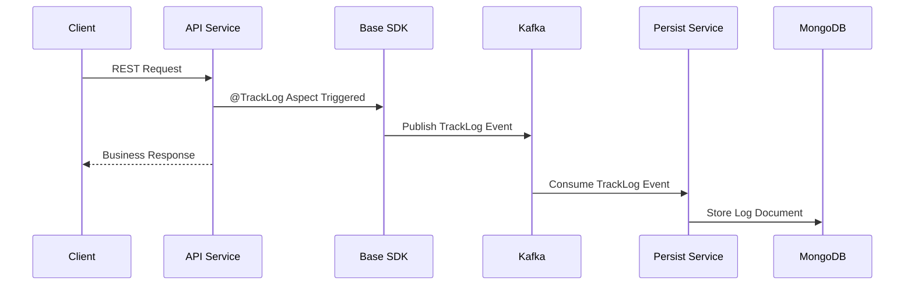

# Reverse Words API – Microservices Demo with Reusable Base SDK

## 📌 Overview
This project demonstrates a **microservices-based Spring Boot architecture** built with a **reusable Base SDK** that provides cross-cutting capabilities like:

- Request/Response tracking via custom `@TrackLog` annotation  
- Centralized schema validation  
- Kafka-based event publishing  
- MongoDB persistence  
- Config reusability across services  
- Encryption/Decryption utility for sensitive properties  

The system processes text operations like **reversing words** and **searching words**, while transparently logging activity using an event-driven pipeline.

---

## 🧱 High-Level Architecture

```mermaid
flowchart LR
    Client --> API[Reverse/Search API Service]
    API -->|@TrackLog Event| Kafka[(Kafka / Redpanda)]
    Kafka --> PersistService[Persist Service]
    PersistService --> MongoDB[(MongoDB Atlas)]
    PersistService -->|On Mongo Failure| DLQ[Kafka DLQ Topic]
    PersistService -->|On Kafka Failure| MongoFallback[(Direct Mongo Insert)]
```

---

## 🔄 Request Processing Flow



---

## 🧩 Base SDK (Reusable Foundation)

The **Base SDK** is designed to be shared across services and contains:

### ✔ Track Logging Framework
- Custom annotation: `@TrackLog`
- AOP Aspect intercepts annotated methods
- Captures request, response, headers, execution time, etc.
- Publishes structured event to Kafka

### ✔ Schema Validation
- JSON Schema validation using NetworkNT library
- Centralized validator reusable by all services
- Errors wrapped into a structured validation response

### ✔ Encryption Utility
- Allows encrypted passwords in config
- Demo uses plain text, but SDK supports secure usage

### ✔ Common Config
`base-config.yaml` contains shared properties like:

- Kafka configuration
- Mongo configuration
- Logging
- Encryption settings

Each service imports it:

```yaml
spring:
  application:
    name: persist-service
  config:
    import: >
      classpath:base-config.yaml,
      classpath:persist-service-config.yaml
```

---

## 🛰 Services

### 1️⃣ Reverse Service
- Reverses words in a sentence
- Assumption: Words shorter than 2 characters are treated as validation errors

### 2️⃣ Search Service
- Searches stored sentences/words
- Uses MongoDB text indexes for fast lookup

### 3️⃣ Persist Service
- Kafka consumer
- Stores TrackLog events into MongoDB
- Implements failure handling logic

---

## 🗄 TrackLog MongoDB Schema

Example document stored in `track_logs` collection:

```json
{
  "serviceName": "reverse-service",
  "endpoint": "/reverse",
  "requestBody": {
    "sentence": "hello world"
  },
  "responseBody": {
    "result": "olleh dlrow"
  },
  "severity": "INFO",
  "timestamp": "2026-01-31T10:15:30Z",
  "executionTimeMs": 45
}
```

### 📌 Indexes Created

```javascript
db.track_logs.createIndex({ "requestBody.sentence": "text" }, { name: "requestBody_sentence_text" })
db.track_logs.createIndex({ severity: 1 }, { name: "severity_index" })
```

---

## 🧪 Infrastructure Used

| Component | Technology |
|----------|------------|
| Messaging | Redpanda (Kafka-compatible) |
| Database | MongoDB Atlas |
| Framework | Spring Boot |
| Validation | NetworkNT JSON Schema |
| Logging | SLF4J + Track Aspect |

---

## 🔐 Certificate Demo
For demonstration of SSL/TLS configuration:
- Sample **server** and **client certificates** were generated
- Shows how mutual TLS *could* be configured in real deployments

---

## ⚠ Assumptions Made
- Words with length < 2 are considered invalid for reversal
- Some validation rules are hardcoded but can be moved to a Config Server

---

## 🚧 Enhancements Not Implemented (Time Constraints)

- Centralized Config Server
- Retry with backoff for Kafka & Mongo
- Monitoring dashboards
- Authentication/Authorization layer

### Resilience Design (Planned)
| Failure | Planned Handling |
|--------|------------------|
| Kafka failure in Persist | Direct fallback write to MongoDB |
| MongoDB failure | Publish event to Kafka DLQ |

---

## 🚀 How to Run (Summary)

1. Start Redpanda (Kafka)
2. Start MongoDB Atlas cluster
3. Run Persist Service
4. Run Reverse/Search Services
5. Send REST requests and observe TrackLog entries in MongoDB

---

## 👨‍💻 Author
Garvit Choudhary  
Microservices • Spring Boot • Event-Driven Systems
